> ⚠️ **PROPUESTA PENDIENTE DE VALIDACIÓN CON DISEÑO** — Este prototipo debe ser revisado y aprobado por el equipo de diseño antes de implementarse.

```mermaid
flowchart TD
    %% Generado para HU #2: UI web de gestión de tareas
    %% Una sola vista SPA (desktop-first): listado + formulario inline + campo de token + zona de mensajes

    START["Abrir la aplicación de tareas en el navegador"] --> AUTH{"¿Hay token guardado en el navegador?"}

    subgraph AUTENTICACION ["Autenticación básica (token JWT)"]
        AUTH -->|No| TOKEN_UI["Campo de autenticación visible"]
        TOKEN_UI --> TOKEN_SAVE["(Pegar token JWT y guardar)"]
        TOKEN_SAVE --> TOKEN_OK["Token persistido en el navegador (sobrevive a la recarga)"]
        AUTH -->|Sí| LOAD
        TOKEN_OK --> LOAD
        TOKEN_UI --> TOKEN_RE["(Actualizar token)"]
        TOKEN_RE --> TOKEN_OK
    end

    subgraph LISTADO ["Listado de tareas"]
        LOAD["(Cargar: GET /api/tareas)"] --> LOADING["Indicador 'Cargando…'"]
        LOADING --> LOAD_R{"Respuesta de la API"}
        LOAD_R -->|"200 con tareas"| LIST["Listado: título, descripción y estado de cada tarea"]
        LOAD_R -->|"200 sin tareas"| EMPTY["Mensaje de estado vacío: 'No hay tareas'"]
        LOAD_R -->|"401"| ERR401["Mensaje genérico: token ausente o inválido"]
        LOAD_R -->|"5xx / API inaccesible"| ERRNET["Mensaje genérico: no se puede conectar al servidor"]
        EMPTY --> LIST
        ERR401 --> TOKEN_UI
        ERRNET --> REINTENTAR
    end

    subgraph CREAR ["Crear tarea (formulario inline)"]
        LIST --> FORM["(Completar formulario: título + descripción)"]
        FORM --> FVAL{"¿Título con contenido?"}
        FVAL -->|No| FERR["Mensaje de validación: 'El título es obligatorio' (sin llamar a la API)"]
        FERR --> FORM
        FVAL -->|Sí| FSEND["(Enviar formulario: POST /api/tareas)"]
        FSEND --> FLOAD["Botón enviar deshabilitado (acción en curso)"]
        FLOAD --> FR{"Respuesta de la API"}
        FR -->|"201"| FOK["Listado actualizado con la nueva tarea + formulario limpio + mensaje de éxito"]
        FR -->|"400"| F400["Mensaje genérico: datos inválidos"]
        FR -->|"401"| ERR401
        FR -->|"5xx / API inaccesible"| ERRNET
        FOK --> LIST
    end

    subgraph ACTUALIZAR ["Actualizar tarea (mismo formulario, modo editar)"]
        LIST --> UEDIT["(Elegir tarea para editar: el formulario se rellena con sus valores)"]
        UEDIT --> UVAL{"¿Título con contenido?"}
        UVAL -->|No| FERR
        UVAL -->|Sí| USEND["(Guardar cambios: PUT /api/tareas/:id)"]
        USEND --> UR{"Respuesta de la API"}
        UR -->|"200"| UOK["Listado actualizado + mensaje de éxito"]
        UR -->|"400"| F400
        UR -->|"404"| U404["Mensaje genérico: la tarea no existe + listado refrescado"]
        UR -->|"401"| ERR401
        UR -->|"5xx / API inaccesible"| ERRNET
        UOK --> LIST
    end

    subgraph ESTADO ["Cambiar estado de una tarea"]
        LIST --> ETGL["(Cambiar estado: pendiente / completada)"]
        ETGL --> ES{"Respuesta de la API (PUT /api/tareas/:id)"}
        ES -->|"200"| EOK["Listado actualizado + mensaje de éxito"]
        ES -->|"400"| F400
        ES -->|"404"| U404
        ES -->|"401"| ERR401
        ES -->|"5xx / API inaccesible"| ERRNET
        EOK --> LIST
    end

    subgraph ELIMINAR ["Eliminar tarea"]
        LIST --> DSEND["(Elegir tarea para eliminar: DELETE /api/tareas/:id)"]
        DSEND --> DR{"Respuesta de la API"}
        DR -->|"204"| DOK["Tarea retirada del listado + mensaje de éxito"]
        DR -->|"404"| U404
        DR -->|"401"| ERR401
        DR -->|"5xx / API inaccesible"| ERRNET
        DOK --> LIST
    end

    subgraph REINTENTO ["Reintento tras error"]
        REINTENTAR["(El usuario reintenta la acción)"]
        F400 --> REINTENTAR
        U404 --> REINTENTAR
        REINTENTAR --> FORM
        REINTENTAR --> LOAD
        REINTENTAR --> UEDIT
        REINTENTAR --> ETGL
        REINTENTAR --> DSEND
    end
```

## Notas del wireframe

- **Una sola pantalla**: no hay navegación entre vistas; las secciones (autenticación, listado, crear, actualizar, estado, eliminar) son bloques de la misma SPA.
- **Desktop-first**: sin breakpoints móviles.
- **Estados de carga**: "Cargando…" en el listado y botón enviar deshabilitado durante cualquier acción en curso.
- **Zona de mensajes**: una única zona de feedback (éxito / validación / error genérico por código HTTP) compartida por todas las acciones.
- **Errores genéricos**: la UI no expone el detalle de la API; interpreta el código (400 / 401 / 404 / 5xx / red) y muestra el mensaje correspondiente.
- **401 en el listado** devuelve al usuario al campo de token (el token puede haber expirado).
